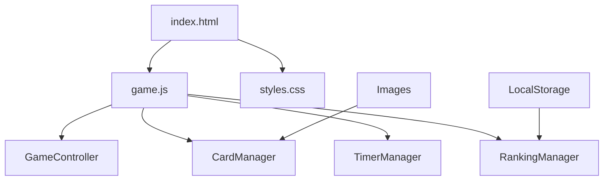

# 神経衰弱ゲーム 設計書

## 概要

HTML5、CSS3、JavaScriptを使用したブラウザベースの神経衰弱ゲームです。カードのめくりアニメーション、タイマー機能、ランキングシステムを備えた完全なゲーム体験を提供します。

## アーキテクチャ

### システム構成



### 技術スタック

- **フロントエンド**: HTML5, CSS3, JavaScript (ES6+)
- **アニメーション**: CSS Transforms & Transitions
- **データ保存**: LocalStorage API
- **画像**: PNG形式（front-face.png, 01.png〜70.png）

## コンポーネントと インターフェース

### 1. GameController クラス

ゲーム全体の状態管理とフロー制御を担当

```javascript
class GameController {
    constructor(timeLimit = 300) // デフォルト5分
    startGame()
    endGame()
    resetGame()
    checkWinCondition()
}
```

### 2. CardManager クラス

カードの生成、配置、めくり処理を管理

```javascript
class CardManager {
    generateCards()
    shuffleCards()
    flipCard(cardId)
    checkMatch(card1, card2)
    resetUnmatchedCards()
}
```

### 3. TimerManager クラス

カウントダウンタイマーの管理

```javascript
class TimerManager {
    constructor(timeLimit)
    start()
    stop()
    getElapsedTime()
    getRemainingTime()
}
```

### 4. RankingManager クラス

スコアの保存と表示を管理

```javascript
class RankingManager {
    saveScore(pairs, time)
    getTopScores()
    displayRanking()
}
```

## データモデル

### Card オブジェクト

```javascript
{
    id: string,           // ユニークID
    imageId: number,      // 画像番号（1-70）
    isFlipped: boolean,   // めくり状態
    isMatched: boolean,   // ペア成立状態
    position: {x, y}      // グリッド位置
}
```

### GameState オブジェクト

```javascript
{
    isPlaying: boolean,
    timeLimit: number,
    elapsedTime: number,
    matchedPairs: number,
    flippedCards: Card[],
    totalCards: 32
}
```

### Score オブジェクト

```javascript
{
    pairs: number,        // 揃えたペア数
    time: number,         // かかった時間（秒）
    date: string,         // プレイ日時
    score: number         // 計算されたスコア
}
```

## UI設計

### レイアウト構造

```
┌─────────────────────────────────────┐
│              ヘッダー                │
│  [START] Timer: 05:00  Score: 0/16  │
├─────────────────────────────────────┤
│                                     │
│        8×4 カードグリッド            │
│    ┌───┬───┬───┬───┬───┬───┬───┬───┐  │
│    │ C │ C │ C │ C │ C │ C │ C │ C │  │
│    ├───┼───┼───┼───┼───┼───┼───┼───┤  │
│    │ C │ C │ C │ C │ C │ C │ C │ C │  │
│    ├───┼───┼───┼───┼───┼───┼───┼───┤  │
│    │ C │ C │ C │ C │ C │ C │ C │ C │  │
│    ├───┼───┼───┼───┼───┼───┼───┼───┤  │
│    │ C │ C │ C │ C │ C │ C │ C │ C │  │
│    └───┴───┴───┴───┴───┴───┴───┴───┘  │
├─────────────────────────────────────┤
│              ランキング              │
└─────────────────────────────────────┘
```

### カードアニメーション

- **めくりアニメーション**: CSS transform rotateY() を使用
- **アニメーション時間**: 0.6秒
- **イージング**: ease-in-out

```css
.card-flip {
    transform: rotateY(180deg);
    transition: transform 0.6s ease-in-out;
}
```

## エラーハンドリング

### 画像読み込みエラー

```javascript
// 画像が見つからない場合のフォールバック
function handleImageError(imageId) {
    console.warn(`Image ${imageId}.png not found`);
    // デフォルト画像を使用
    return 'default-card.png';
}
```

### LocalStorage エラー

```javascript
// ストレージが利用できない場合の処理
function saveToStorage(data) {
    try {
        localStorage.setItem('memoryGameRanking', JSON.stringify(data));
    } catch (error) {
        console.warn('LocalStorage not available:', error);
        // セッションストレージまたはメモリ保存にフォールバック
    }
}
```

### ゲーム状態の整合性チェック

```javascript
function validateGameState() {
    // カード数の確認
    // ペア数の確認
    // タイマー状態の確認
}
```

## テスト戦略

### 単体テスト

1. **CardManager テスト**
   - カード生成の正確性
   - シャッフル機能
   - ペア判定ロジック

2. **TimerManager テスト**
   - カウントダウン機能
   - 時間計算の正確性

3. **RankingManager テスト**
   - スコア計算
   - ソート機能
   - データ永続化

### 統合テスト

1. **ゲームフロー テスト**
   - 開始→プレイ→終了の流れ
   - 勝利条件の判定
   - 時間切れ処理

2. **UI インタラクション テスト**
   - カードクリック処理
   - アニメーション動作
   - レスポンシブ対応

### パフォーマンステスト

1. **画像読み込み最適化**
   - 画像プリロード
   - 遅延読み込み

2. **アニメーション最適化**
   - GPU加速の活用
   - フレームレート維持

## セキュリティ考慮事項

### XSS対策

- ユーザー入力のサニタイズ
- innerHTML の適切な使用

### データ保護

- LocalStorage データの暗号化（オプション）
- 不正なスコア操作の防止

## 拡張性

### 将来の機能追加

1. **難易度レベル**
   - カード枚数の変更（4×4, 6×6, 8×4）
   - 制限時間の調整

2. **テーマシステム**
   - 複数の画像セット
   - カスタムテーマ

3. **マルチプレイヤー**
   - 対戦モード
   - オンラインランキング

### 技術的拡張

1. **PWA対応**
   - Service Worker
   - オフライン機能

2. **モバイル最適化**
   - タッチ操作対応
   - レスポンシブデザイン